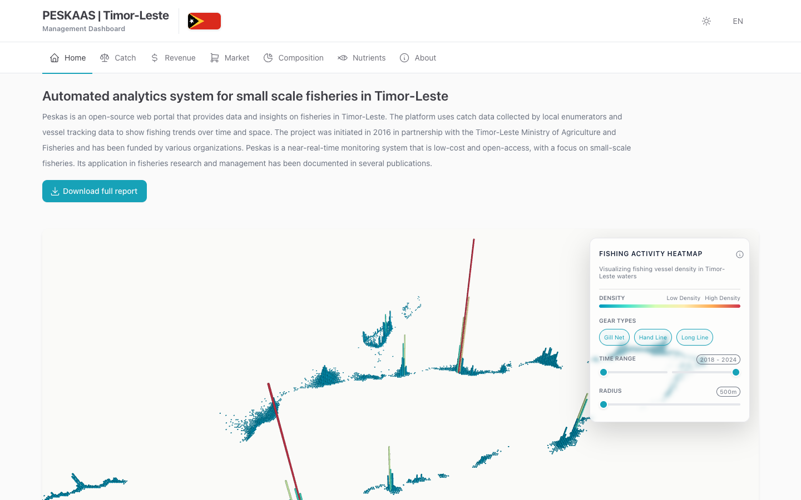

# Peskas Timor-Leste

The public website for data on Timor-Leste's small-scale fisheries: catch, revenue, prices, the species caught and the nutrition they provide.

[timor.peskas.org](https://timor.peskas.org)



## What it is

Peskas Timor-Leste shows national and municipal figures on small-scale fisheries for fisheries managers, researchers, partners and the public. It is open to everyone without a login, and is available in English, Tetum and Portuguese.

## What you can do

- Follow catch and revenue month by month, for the whole country or one municipality, and compare habitats and fishing gears.
- Check fish prices per kilogram over time and by municipality, and how fishers keep their catch on board (Market page).
- See which fish groups make up the catch in each municipality (Composition page).
- See how many people's recommended daily intake of protein, iron, zinc, vitamin A, omega-3, vitamin D and calcium the catch could meet (Nutrients page).
- See on a heatmap where tracked boats fish, filtered by gear and year.
- Read how the data are collected and processed (About page), and [download the full data report](https://storage.googleapis.com/public-timor/data_report.html).

## Where the data comes from

- **Landing surveys.** Enumerators (trained data collectors) record landings at landing sites around the country using KoboToolbox, a free mobile survey app. A landing is a boat's return to shore with its catch.
- **GPS trackers (Pelagic Data Systems).** Small solar-powered devices on a sample of boats record where they travel. They feed the fishing heatmap. The gear shown on the heatmap is predicted by a model from how each boat moves, not recorded directly.

The Peskas Timor-Leste data pipeline checks these records and turns them into monthly summaries. When a municipality has too little data in a month, a statistical model fills the gap; when you choose a municipality, the trend charts mark those months as "Estimated". This website copies the latest summaries every day.

## Who runs it

Peskas Timor-Leste is a partnership, running since 2016, between [WorldFish](https://worldfishcenter.org) and the Timor-Leste Ministry of Agriculture and Fisheries' Department of Fisheries, Aquaculture and Marine Resources. Since 2021 it has been funded by the Government of Timor-Leste, with technical support from WorldFish and Pelagic Data Systems. For questions, write to <peskas.platform@gmail.com>.

## Part of Peskas

Peskas is WorldFish's open-source platform for monitoring small-scale fisheries (https://peskas.org).

- [Peskas Zanzibar](https://zanzibar.peskas.org), [Peskas Kenya](https://peskas-dashboard-kenya.vercel.app/en), [Peskas Mozambique](https://peskas-dashboard-mozambique.vercel.app): country dashboards
- [Peskas Coasts](https://coasts.peskas.org): regional comparison across countries
- [Peskas Tracks](https://tracks.peskas.org): app for fishers to see their trips and log catches
- [Peskas Kenya BMU dashboard](https://digitalfisheries.kenya.peskas.org): dashboard for Beach Management Units in Kenya
- [Peskas Management Platform](https://validation.peskas.org): data review and download for survey teams
- [Peskas Fishery Data API](https://api.peskas.org/docs): programmatic access to landing data
- Data pipelines: [Kenya](https://github.com/WorldFishCenter/peskas.kenya.data.pipeline), [Zanzibar](https://github.com/WorldFishCenter/peskas.zanzibar.data.pipeline), [Mozambique](https://github.com/WorldFishCenter/peskas.mozambique.data.pipeline), [Timor-Leste](https://github.com/WorldFishCenter/peskas.timor.data.pipeline), [Coasts](https://github.com/WorldFishCenter/peskas.coasts)

## For developers

A React 19 + TypeScript single-page app built with Vite and deployed on Vercel. It replaces the earlier R/Shiny portal. There is no backend: the app loads static JSON files from `public/data/`.

**Requirements:** Node.js 20.19 or later.

**Setup**

```bash
npm install
npm run dev
```

**Data.** `npm run fetch-data` (`scripts/fetchData.js`) downloads the newest `portal-*` files from the Google Cloud Storage bucket `public-timor`, written by the [Timor-Leste data pipeline](https://github.com/WorldFishCenter/peskas.timor.data.pipeline), into `public/data/`. It reads a service account key from `GCP_SERVICE_ACCOUNT_KEY` (see `.env.example`), or else `GOOGLE_APPLICATION_CREDENTIALS` or gcloud default credentials. Fix data problems in the pipeline, not in `public/data/`.

**Main commands:** `npm run dev`, `npm run build`, `npm run lint`, `npm run preview`, `npm run fetch-data`.

**Production.** Vercel deploys `main` to production. `.github/workflows/sync-data.yml` runs the data fetch daily at 00:00 UTC, on every push to `main` and on demand, and commits any changed files in `public/data/`; each such commit redeploys the site. `vercel.json` sends every path to `index.html` and sets cache and security headers.

**Releases:** there is no NEWS.md or release workflow yet.

**Tests:** no automated tests yet.

**AI-assisted work:** see `CLAUDE.md`.
